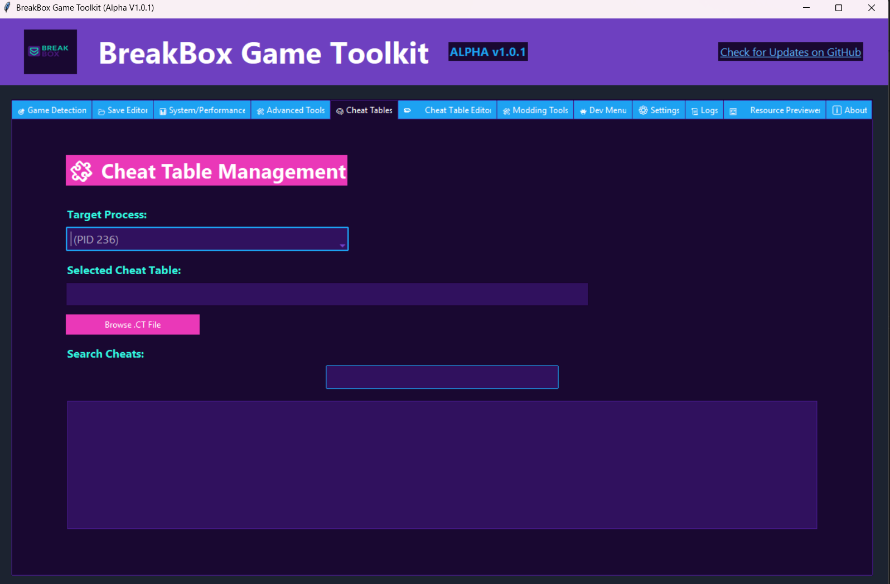
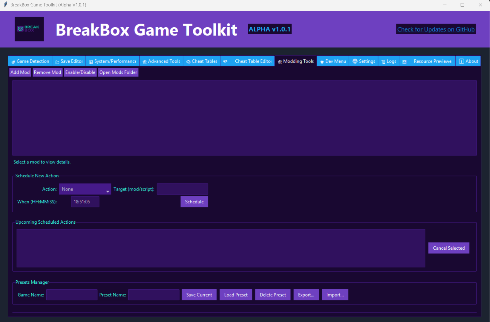

# 🎮 BreakBox Game Toolkit

BreakBox is a modular, feature-rich game editing and debugging toolkit built for Windows. Designed with gamers, modders, and reverse engineers in mind, it provides everything from memory scanning and save editing to mod injection and live game manipulation all from a clean GUI powered by ttkbootstrap.

THIS PROGRAM IS FOR EDUCATIONAL PURPOSES ONLY!
USE THIS AT YOUR OWN RISK! 
I AM NOT RESPONSIBLE FOR YOUR OR ANBODYS' ACTIONS!


# 🧰 BreakBox Game Toolkit

**A modern, all-in-one game editing, modding, and analysis utility.**

BreakBox provides advanced tools for PC single-player games: edit saves, manage mods, import cheat tables, scan memory, and more—all with a stylish, Malwarebytes-inspired interface.

---

## 🚀 Features

- **Game Detection**
  - Find & target running games by process name.
  - Warns about targeting system/critical processes.

- **Save File Editor**
  - Edit player stats (health, resources, level).
  - Backup, reset, undo/redo, and a built-in hex editor.

- **Cheat Table Management**
  - Import/search/filter Cheat Engine `.CT` tables.
  - Apply cheats directly, export as JSON, or launch in Cheat Engine.
  - Full cheat table editor (add/edit/remove entries).

- **Mod Manager**
  - Drag-and-drop mod importing.
  - Enable/disable, remove, and safe handling of mods.

- **Advanced Tools**
  - Memory snapshot, scan, and live edit.
  - Asset replacement, file integrity checks, encryption/decryption.

- **Performance & System Tools**
  - Real-time performance meter.
  - Scheduled actions, Steam/Discord integration.

- **Logs & Settings**
  - Log viewer with search and filter.
  - Theme switcher (modern/dark), settings backup/restore/reset.

- **Resource Previewer**
  - View text, binary, and image files in-app.

- **Developer Menu**
  - Hidden panel with power-user/dev options.

---

## 📸 Screenshots

```md



⚡ Quickstart
Install Python 3.9+ (recommend python.org)

Clone this repository:

git clone https://github.com/TentandTableStudios/BreakBox-Game-Toolkit.git
cd BreakBox-Game-Toolkit

Install requirements:
pip install -r requirements.txt

Run the app:
python main.py

Windows:
For drag-and-drop, you may need tkinterdnd2:
pip install tkinterdnd2

To Compile into a .EXE:
pyinstaller --noconsole --onefile --add-data "assets;assets" --add-data "features;features" --add-data "settings.json;." main.py

⚠️ Known Issues
Process Detection:

Not all protected games or anti-cheat processes are accessible.

System processes may appear—do not target them.

Memory Editing:

Can cause crashes or instability if misused (especially outside supported games).

Drag-and-Drop:

May not be supported on all OS/platforms.

Cheat Table Compatibility:

Pointer/Mono/IL2CPP or encrypted .CT tables may not work reliably.

Cheat Engine scripts/injected code are not supported directly.

Resource Previewer:

Large or unsupported files may crash/slow the previewer.

Theme Switching:

Changing themes at runtime may cause minor UI glitches.

🛡️ Security & Privacy
All modding/editing is local.
BreakBox never uploads data or contacts external servers (except for GitHub update checks).

Only import mods/cheats from trusted sources.

Logs may contain sensitive file paths—keep private as needed.

🛠️ Contributing
Pull requests are welcome!

Follow PEP8 style and use docstrings & type hints for new modules.

See the features/ directory for modular extension structure.

Please report bugs or feature requests via GitHub Issues.

📃 License
MIT License.
See LICENSE for details.

Made with ❤️ by Tent and Table Studios

  "The heart of the discerning acquires knowledge, for the ears of the wise seek it out."
— Proverbs 18:15 (NIV)
