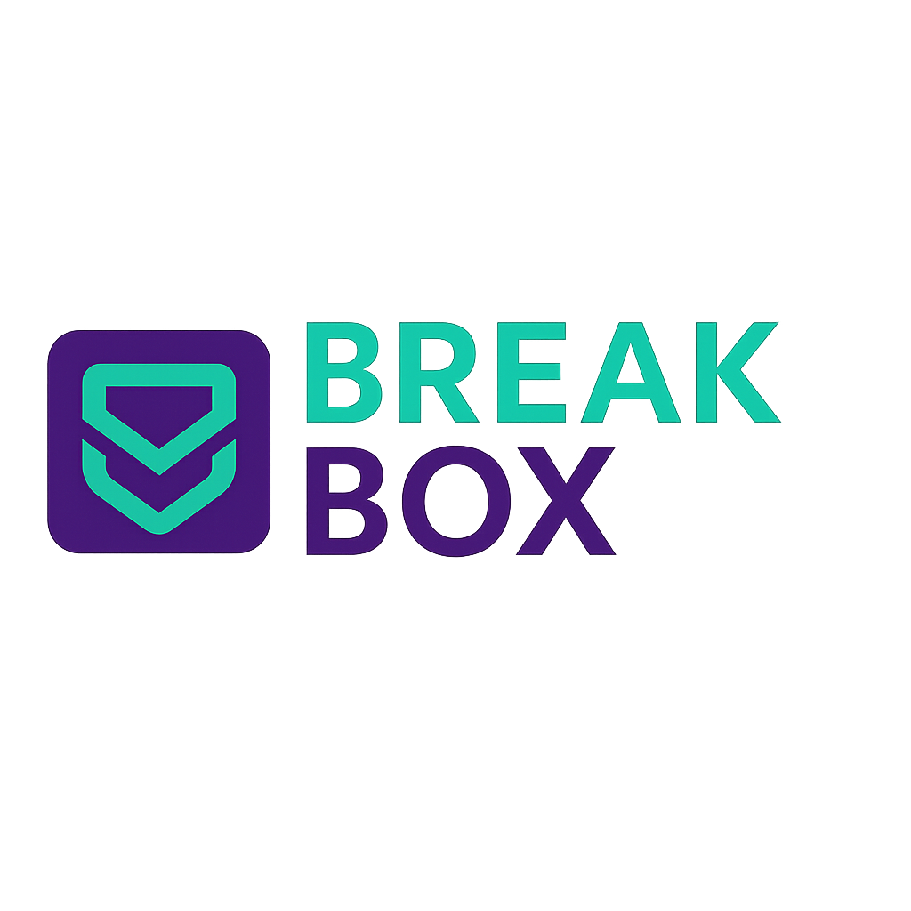

# 🎮 BreakBox Game Toolkit

BreakBox is a modular, feature-rich game editing and debugging toolkit built for Windows. Designed with gamers, modders, and reverse engineers in mind, it provides everything from memory scanning and save editing to mod injection and live game manipulation — all from a clean GUI powered by ttkbootstrap.

THIS PROGRAM IS FOR EDUCATIONAL PURPOSES ONLY!
USE THIS AT YOUR OWN RISK! 
I CREATED THIS PROJECT TO USE FOR PERSONAL USE BUT DECIDED TO RELEASE IT. 
I AM NOT RESPONSIBLE FOR YOUR OR ANBODYS' ACTIONS!



---

## ✨ Features

- 🎯 **Game Detection** – Find running processes by name
- 📂 **Save Editor** – Modify save values like health, resources, level
- 🛠 **Advanced Tools**
  - Memory scanning and editing
  - Toggle trainer options (e.g. god mode)
  - Resource injection
  - Save file corruption simulations
  - Config tweaking and custom script execution
- 🧠 **Intelligence Suite**
  - Watch memory addresses live
  - Auto backup system
  - Cheat profile import/export
- 🧪 **Coming Soon**
  - Cheat Table Importer
  - Mod Manager
  - Performance Meter
  - Hex Editor
  - Game Presets
- 📜 **Log Viewer** – View activity logs in real-time
- ⚙️ **Settings** – Theme switcher with instant apply
- 🌐 **GitHub Update Checker** – Check for the latest version

---

## 📦 Installation

### Requirements

- Python 3.9+ - https://www.python.org/downloads/
- Windows 10/11

### Dependencies

Install all required dependencies with:

```bash
pip install -r requirements.txt

### Compile into a .exe
pyinstaller ^
  --noconfirm ^
  --onefile ^
  --windowed ^
  --icon=assets/logo.ico ^
  --add-data "assets;assets" ^
  --add-data "settings.json;." ^
  --hidden-import PIL.ImageTk ^
  --hidden-import PIL._imagingtk ^
  --collect-submodules PIL ^
  main.py

  "The heart of the discerning acquires knowledge, for the ears of the wise seek it out."
— Proverbs 18:15 (NIV)
